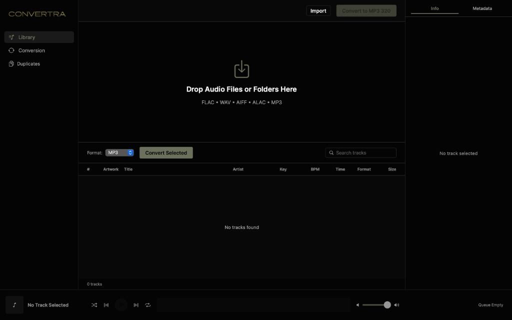
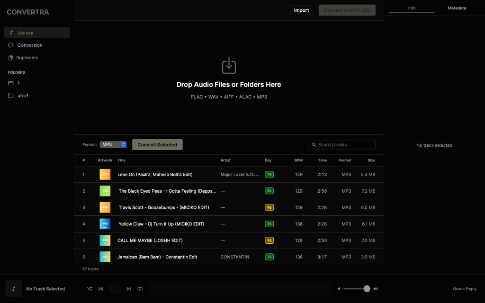
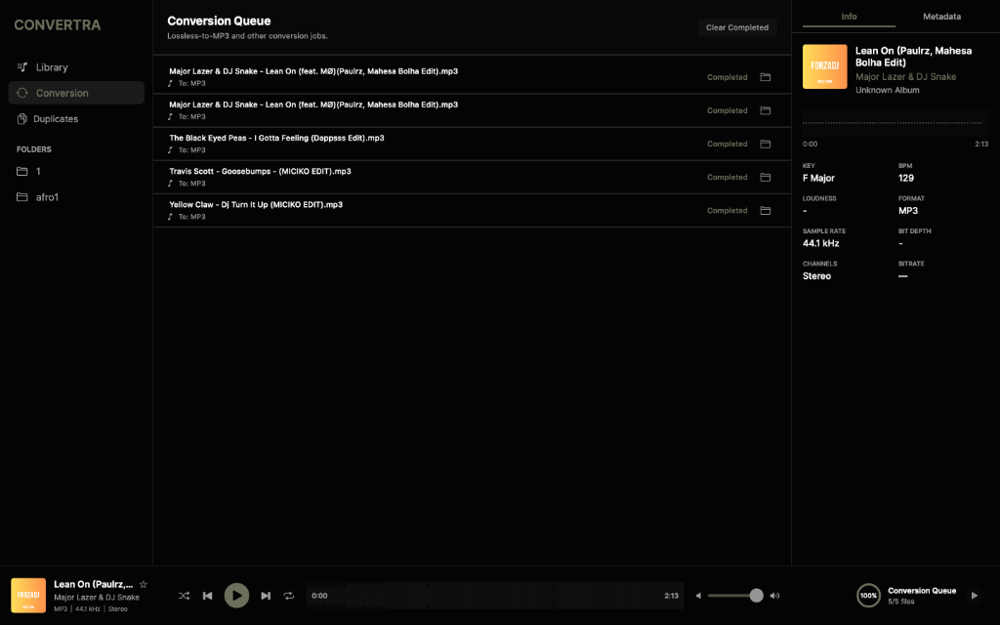

# Convertra

## Screenshots





## Product description

Convertra is a native macOS audio-library and conversion application for DJs and music professionals — a local, offline alternative to the analysis/tagging workflow found in rekordbox, Serato, and Mixed In Key.

It provides a macOS-native workflow for:
- audio library ingestion and organization;
- proprietary local key/BPM analysis (**Convertra AudioCore**);
- mp3tag-grade metadata inspection and editing, including cover art;
- audio playback with waveform visualization;
- lossless-to-MP3 conversion.

## Convertra AudioCore

**Convertra AudioCore** is Convertra's proprietary digital-signal-processing engine for musical key and tempo detection — the same class of technology that powers Mixed In Key, rekordbox's track analysis, and Serato's Pitch'n Time / key detection. It runs **100% on-device**: no cloud calls, no third-party analysis API, no neural network — pure DSP over Apple's Accelerate/vDSP.

**Validated accuracy** — measured against Mixed In Key ground-truth tags over 111 real commercial tracks (house, tech-house, hip-hop, pop):

| Metric | Result |
|---|---|
| Key — exact Camelot match | **~70%** |
| Key — harmonic/mix-compatible match | **~83%** |
| Tempo — within ±0.5 BPM | **~82%** |
| Analysis time per track | **~1 second** (release build) |

These are honest, reproducible numbers from a from-scratch DSP rewrite (peak-picking harmonic pitch-class profiling for key; autocorrelation with parabolic sub-BPM interpolation for tempo) — not vendor marketing claims. The methodology and harness that produced them are described in [`HANDOFF.md`](./HANDOFF.md).

### Distribution model

The AudioCore DSP engine (`ConvertraKeyEngine` / `ConvertraTempoEngine`) is compiled as a closed-source `.xcframework` binary at [`Frameworks/ConvertraAudioCore.xcframework`](./Frameworks) — see [`Frameworks/README.md`](./Frameworks/README.md). The rest of this repository (UI, library management, metadata, conversion, and the thin adapters that call into AudioCore) is source-available so the app can be built, inspected, and extended freely; the DSP itself is Convertra's core IP and is licensed, not published.

**Licensing / OEM inquiries**: if you're building a DJ app, library manager, or analysis tool and want Convertra AudioCore as a drop-in key/BPM engine (SDK, white-label, or acquisition), reach out — see [Contact](#contact).

The production analysis path is:

`AppViewModel.scanAndAdd()`
→ `AudioTechnicalMetadataExtractor.analyze()`
→ `AudioAnalysisEngine2.analyze()`
→ `AudioDecoder` (fast single-pass decode via `AVAssetReader`)
→ `KeyDetector` / `TempoDetector` *(thin adapters → Convertra AudioCore binary, run concurrently)*
→ `BeatTracker` / `DownbeatDetector`
→ `AudioAnalysisResult2`
→ `AudioAnalysis2Adapter`
→ `AudioAnalysis`
→ `TrackListView` / `TrackInspectorView`

## Current capabilities

- **Native SwiftUI macOS application**: Built entirely with Swift and modern macOS frameworks.
- **File/folder selection & drag-and-drop ingestion**: Intuitive import workflows via native macOS panels and drop targets.
- **Recursive audio discovery**: Efficient scanning of deeply nested directories for supported audio formats.
- **Persistent library**: Delta-sync SQLite (CoreData) persistence, storing every metadata field so nothing is lost on relaunch.
- **Convertra AudioCore analysis**: On-device DSP for BPM, Camelot keys, and beat grids — see above.
- **mp3tag-style metadata editing**: title, artist, album artist, genre, year, track/disc number, composer, grouping, publisher/label, comment, ISRC, copyright, and BPM/key tags — batch-editable, with a cover-art well (replace/remove/drag-and-drop) that embeds artwork natively into MP3 **and AIFF** (a native ID3v2 writer, since FFmpeg silently drops AIFF cover art).
- **Duplicate detection**: Finds duplicate tracks across the library.
- **Audio playback**: Native AVFoundation player with dynamic waveform visualization.
- **Lossless-to-MP3 conversion**: FFmpeg-powered batch conversion queue with a user-chosen destination folder.

## Engineering highlights

- Native Swift + SwiftUI macOS application.
- Apple-native audio technologies (AVFoundation, Accelerate, vDSP).
- Local asynchronous processing; tempo and key detection run concurrently per track.
- Actor-based/background library scanning.
- Security-scoped resource handling for robust sandbox compliance.
- Proprietary on-device DSP analysis through Convertra AudioCore, distributed as a signed binary framework.
- No Electron/web wrappers, no cloud analysis dependency.
- Universal binary (Apple Silicon + Intel).

*(Note: Batch conversion utilizes a bundled FFmpeg command runner for container/codec work; the analysis and playback pipelines are entirely native.)*

## Architecture

The repository is structured around a domain-driven feature architecture:

```text
App/                    Application lifecycle, main view models, and UI routing
Core/
  Audio/                Supported formats and audio player engines
  Models/               Domain models (AudioFile, AudioAnalysis, ConversionJob, etc.)
  Services/             Core business logic:
    Analysis/           AudioAnalysisEngine2 + thin adapters into Convertra AudioCore
    Metadata/           Native ID3v2 tag/cover-art writer (MP3, AIFF)
    AudioLibraryScanner Audio ingestion and discovery
    LibraryPersistence  CoreData / SQLite storage (full-fidelity JSON payload)
    ConversionEngine    Batch audio conversion handling
Features/
  Library/              Track list, drag-and-drop handling, and track inspector UI
  Duplicates/            Duplicate-detection UI
  Conversion/            Conversion queue UI
  Player/                Player view model and waveform UI components
Frameworks/              Convertra AudioCore (compiled .xcframework — see Frameworks/README.md)
Tests/                   Unit tests and integration coverage
UI/                      Shared UI components, theming, layouts, splash screen
Resources/               Asset catalogs and bundled resources
```

## Requirements

- macOS Monterey 12.0 or later
- Xcode 15.2 (or a compatible Xcode release)
- Swift 5.9+

## Build, Test & Package

```bash
git clone https://github.com/hamidkazimov777-cmd/convertra.git
cd convertra

# Run test suite
swift test

# Build and package signed Convertra.app bundle
./package_app.sh
```

The resulting release app bundle is generated at `Convertra.app`. The build links against the prebuilt `Frameworks/ConvertraAudioCore.xcframework` — no separate setup needed.

## Documentation

For a detailed development/continuity record (including the AudioCore accuracy methodology), see [HANDOFF.md](./HANDOFF.md).

## Contact

Built by Hamid Kazimov. For professional inquiries, AudioCore licensing, or collaboration, contact [@hamidkazim on Telegram](https://t.me/hamidkazim).
